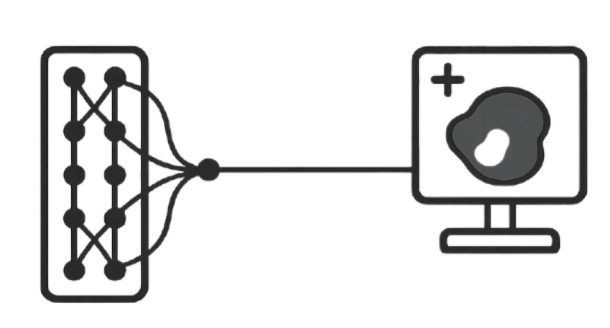

<p align="center">
  
</p>


# UNet Zoo: A PyTorch Library for UNet Variants


<!-- You can add more badges here, e.g., for CI/CD, code style, etc. -->

## 🌟 Overview

Welcome to `UNet Zoo`, a comprehensive PyTorch library dedicated to various UNet architectures for medical image segmentation and beyond. Inspired by the flexibility and standardization of the `timm` (PyTorch Image Models) library, `UNet Zoo` aims to provide a unified, easy-to-use API for creating, training, and experimenting with a wide range of UNet-based models.

The proliferation of UNet variants can make it challenging to compare and utilize them effectively. This project addresses that by:
*   **Centralizing implementations:** All models are available under a consistent API.
*   **Standardizing usage:** Easy model instantiation and integration into training pipelines.
*   **Promoting reusability:** Common layers, data handling, and utilities are shared.

Whether you're a researcher exploring new architectures or a practitioner applying state-of-the-art segmentation models, `UNet Zoo` is designed to streamline your workflow.

## ✨ Features

*   **Unified Model API:** Instantiate any UNet variant with a single `create_model()` function, similar to `timm.create_model()`.
*   **Extensive Model Collection:** Includes classic UNet, Attention UNet, various Transformer-UNet hybrids, and more.
*   **Modular Design:** Clean separation of models, data handling, and utility functions for easy extension and maintenance.
*   **Reusable Training Utilities:** Common components like `EarlyStopping`, `Logger`, `LR Schedulers`, `Metrics`, and a generic `TrainingLoop` are provided.
*   **Config-driven Training:** Easily manage and reproduce experiments using YAML configuration files.
*   **Extensibility:** Simple to add new UNet variants or customize existing components.
*   **(Future) Pre-trained Weights:** Support for loading pre-trained weights for specific architectures.

## 🚀 Installation

### Prerequisites

*   Python 3.7+
*   PyTorch 1.8+

### Setup

1.  **Clone the repository:**
    ```bash
    git clone https://github.com/yourusername/my_unet_project.git
    cd my_unet_project
    ```
    *(Replace `yourusername/my_unet_project.git` with your actual repository URL)*

2.  **Install the package in editable mode:**
    This allows you to make changes to the `unet_zoo` source code directly and have them reflected without re-installation.
    ```bash
    pip install -e .
    ```

3.  **Install dependencies:**
    ```bash
    pip install -r requirements.txt
    ```

## 📚 Usage

### 1. Creating a Model

The core of `UNet Zoo` is the `create_model` function, which allows you to instantiate any available UNet variant by its string name.

```python
import torch
from unet_zoo import create_model, list_models

# List all available models
print("Available models:", list_models())
# Expected output: Available models: ['attention_unet', 'da_transformer_unet', ..., 'unet']

# Create a standard UNet model
unet_model = create_model('unet', in_channels=3, num_classes=1)
print(f"Created model: {unet_model.__class__.__name__}")
# Output: Created model: UNet

# Create an Attention UNet model
attention_unet_model = create_model('attention_unet', in_channels=3, num_classes=1, depth=4)
print(f"Created model: {attention_unet_model.__class__.__name__}")
# Output: Created model: AttentionUNet

# You can pass any model-specific arguments as keyword arguments:
missformer_model = create_model('missformer_unet', in_channels=1, num_classes=2, embed_dim=768)
print(f"Created model: {missformer_model.__class__.__name__}")

# Example inference with a dummy tensor
dummy_input = torch.randn(1, 3, 256, 256)
output = unet_model(dummy_input)
print(f"Output shape: {output.shape}")
```
### 2. Training a Model

Training is handled via the `scripts/train.py` script, which loads configuration from a YAML file.

1.  **Review the Configuration:**
    Inspect `configs/default_config.yaml` to understand and modify training parameters, model choice, data paths, etc.

    ```yaml

    model:
      name: "attention_unet"
      params:
        in_channels: 3
        num_classes: 1
        depth: 5
    data:
      train_path: "/path/to/your/train/data"
      val_path: "/path/to/your/val/data"

    ```

2.  **Run Training:**
    Execute the training script from the project root:
    ```bash
    python scripts/train.py --config configs/default_config.yaml
    ```
    You can create and use your own config files for different experiments:
    ```bash
    cp configs/default_config.yaml configs/my_experiment.yaml

    python scripts/train.py --config configs/my_experiment.yaml
    ```

## 🏗️ Available Models

Here's a list of the UNet variants currently implemented in `UNet Zoo`:

#### Core UNet Models

* `unet`: Original UNet
* `attention_unet`: Attention UNet
* `nested_unet`: Nested UNet (UNet++)
* `multiresunet`: MultiResUNet
* `resunet`: ResUNet


#### Transformer-Enhanced UNet Models

* `transatt_unet`: TransAtt-UNet
* `da_transformer`: DA-Transformer UNet
* `unet_transformer`: UNet-Transformer
* `uctransnet`: UCTransNet
* `missformer`: MissFormer UNet
* `swin_unet_v2`: Swin UNet V2


#### Specialized UNet Variants

* `raunet`: RAUNet
* `vnet`: Adapted 2D VNet **(Check compatibility closely)**
* `u2net`: U²-Net
* `u2netp`: U²-Net-P
* `wranet`: WRANet **(Originally for image restoration, adapted for segmentation)**
* `egeunet`: EGEUNet **(Supports deep supervision)**


#### UNext Variants

* `unext`: UNext (larger variant)
* `unext_s`: UNext-S (smaller variant)


#### Specialized Medical/Attention Models

* `mmunet`: MMUNet
* `axialunet`: MedT_Net variant 1
* `gated`: MedT_Net variant 2
* `medt`: MedT_Net variant 3 (main MedT)
* `logo`: MedT_Net variant 4


Each model is implemented in its own file under `unet_zoo/models/`. Common layers used across models are in `unet_zoo/models/common_layers.py`.

## 🗺️ Roadmap

* **More UNet Variants:** Continuously add new and promising UNet architectures.
* **UNet-Inspired Models:** Expand to include UNet-inspired architectures for various segmentation tasks.
* **Benchmarking:** Provide standardized benchmarks for model performance on common datasets.
* **Advanced Training Features:** Support for distributed training, mixed precision, and more sophisticated loss functions.
* **Comprehensive Documentation:** Detailed API documentation for all modules and functions.
* **Model Card Integration:** Provide templates for creating model cards.


## 🤝 Contributing

We welcome contributions of all kinds! Whether you're reporting a bug, suggesting a new feature, improving existing code, adding a new UNet variant, or enhancing documentation, your help is valuable.


## 📄 License
### Code
The code here is licensed Apache 2.0. I've taken care to make sure any third party code included or adapted has compatible (permissive) licenses such as MIT, BSD, etc. I've made an effort to avoid any GPL / LGPL conflicts. That said, it is your responsibility to ensure you comply with licenses here and conditions of any dependent licenses. Where applicable, I've linked the sources/references for various components in docstrings. If you think I've missed anything please create an issue.

## 🙏 Acknowledgements

* Inspired by the excellent `timm` library by Ross Wightman.
* Thanks to the authors of the original UNet variants for their groundbreaking work.


## 📖 Citing

### BibTeX

```bibtex
@misc{fadhullah2025unetzoo,
  author = {Muhamad Irfan Fadhullah},
  title = {UNet Zoo},
  year = {2025},
  publisher = {GitHub},
  journal = {GitHub repository},
  doi = {10.5281/zenodo.15834881},
  howpublished = {\url{https://github.com/irfanfadhullah/unet-zoo}}
}
```


### Latest DOI

[](https://zenodo.org/badge/latestdoi/15834881)
